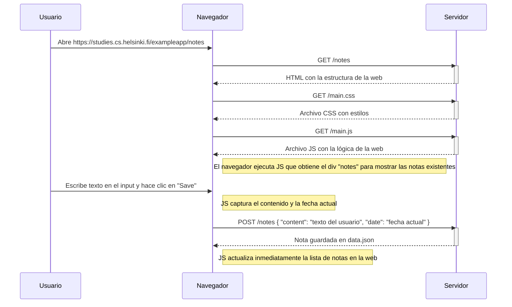

```mermaid
sequenceDiagram
    participant user as Usuario
    participant browser as Navegador
    participant server as Servidor

    %% Carga inicial de la página
    user->>browser: Abre https://studies.cs.helsinki.fi/exampleapp/notes
    browser->>server: GET /notes
    activate server
    server-->>browser: HTML con la estructura de la web
    deactivate server

    browser->>server: GET /main.css
    activate server
    server-->>browser: Archivo CSS con estilos
    deactivate server

    browser->>server: GET /main.js
    activate server
    server-->>browser: Archivo JS con la lógica de la web
    deactivate server

    Note right of browser: El navegador ejecuta JS que obtiene el div "notes" para mostrar las notas existentes

    %% Usuario crea una nueva nota
    user->>browser: Escribe texto en el input y hace clic en "Save"
    Note right of browser: JS captura el contenido y la fecha actual
    browser->>server: POST /notes { "content": "texto del usuario", "date": "fecha actual" }
    activate server
    server-->>browser: Nota guardada en data.json
    deactivate server
    Note right of browser: JS actualiza inmediatamente la lista de notas en la web
```